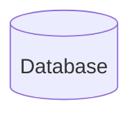

# MD5 Hashing in Java

## 1. Overview

>The **MD5 message-digest algorithm**`[ˈælɡərɪðəm]` is a cryptographically broken but still widely used [hash function](https://en.wikipedia.org/wiki/Hash_function) producing a 128-[bit](https://en.wikipedia.org/wiki/Bit) (16-byte)hash value. Although MD5 was initially designed to be used as a [cryptographic hash function](https://en.wikipedia.org/wiki/Cryptographic_hash_function), it has been found to suffer from extensive vulnerabilities. It can still be used as a [checksum](https://en.wikipedia.org/wiki/Checksum) to verify [data integrity](https://en.wikipedia.org/wiki/Data_integrity), but only against unintentional corruption. It remains suitable for other non-cryptographic purposes, for example for determining the partition for a particular key in a [partitioned database](https://en.wikipedia.org/wiki/Partition_(database)).[[](https://en.wikipedia.org/wiki/MD5#cite_note-3)
>
>MD5 消息摘要算法是一种密码破译但仍被广泛使用的散列函数，可生成 128 位（16个字符(BYTES)）散列值。 尽管 MD5 最初设计为用作加密散列函数，但已发现它存在大量漏洞。 它仍然可以用作校验和来验证数据完整性，但只能用于防止意外损坏。 它仍然适用于其他非加密目的，例如确定分区数据库中特定密钥的分区。
>
>MD5算法无法防止[碰撞攻击](https://zh.wikipedia.org/w/index.php?title=碰撞攻击&action=edit&redlink=1)，因此不适用于安全性认证，如[SSL](https://zh.wikipedia.org/wiki/SSL)[公开密钥认证](https://zh.wikipedia.org/wiki/公開金鑰認證)或是[数字签名](https://zh.wikipedia.org/wiki/數位簽章)等用途。对于需要高度安全性的资料，专家一般建议改用其他算法，如[SHA-2](https://zh.wikipedia.org/wiki/SHA-2)。一般128位的MD5散列被表示为32位[十六进制](https://zh.wikipedia.org/wiki/十六进制)数字。

在这篇文章中，我们将介绍使用不同的**Java libraries**去创建MD5散列值。

## 2. MD5 Using MeassageDigest Class

*java.security.MessageDigest* 类为应用程序提供了一个消息摘要算法，例如 MD5、SHA-1、SHA-256(默认支持这三种)，消息摘要是一个 *one-way(单项)* 的散列函数，它采用任意大小数据并输出一个固定长度的哈希值。

1. 传入你想使用的算法名称来创建 *MessageDigest* 实例：

   ```java
   MessageDigest.getInstance(String Algorithm)
   ```

2. 使用 `update()` 函数更新消息摘要：

   ```java
   public void update(byte [] input)
   ```

3. 当您在阅读一个长文件时可以多次调用上述函数。使用 `reset()` 函数可以重置消息摘要：

   ```java
   public void reset()
   ```

4. 当所有要更新的数据都已更新，最后我们使用 `digest()` 函数来生成hash值；`digest()` 函数被调用后，*MessageDigest* 实例将重置为初始状态：

   ```java
   public byte[] digest()
   ```

**Example: generates a hash for a password**

下面是一个为密码生成hash值并验证它的示例：

```java
@Test
public void givePassword_whenHashing_thenVerifying() throws NoSuchAlgorithmException {
    String hash = "35454B055CC325EA1AF2126E27707052";
    String password = "ILoveJava";

    MessageDigest md5 = MessageDigest.getInstance("MD5");
    md5.update(password.getBytes());
    byte[] digest = md5.digest();
    String myHash = DatatypeConverter
        .printHexBinary(digest).toUpperCase();
    assertThat(myHash, equalTo(hash));
}
```

**Example: verify checksum of a file**

类似的，我们也可以验证文件的校验和：

```java
@Test
public void givenFile_generatingChecksum_thenVerifying() 
  throws NoSuchAlgorithmException, IOException {
    String filename = "src/test/resources/test_md5.txt";
    String checksum = "5EB63BBBE01EEED093CB22BB8F5ACDC3";
        
    MessageDigest md = MessageDigest.getInstance("MD5");
    md.update(Files.readAllBytes(Paths.get(filename)));
    byte[] digest = md.digest();
    String myChecksum = DatatypeConverter
      .printHexBinary(digest).toUpperCase();
        
    assertThat(myChecksum.equals(checksum)).isTrue();
}
```

注意：**MessageDigest is not thread-safe**，因此，您应该为每个线程创建一个新实例！

## 3. MD5 Using Apache Commons

*org.apache.commons.codec.digest.DigestUtils* 类让事情变得简单！

请看为密码生成 hash 值并验证它的示例

```java
@Test
public void givenPassword_whenHashingUsingCommons_thenVerifying()  {
    String hash = "35454B055CC325EA1AF2126E27707052";
    String password = "ILoveJava";

    String md5Hex = DigestUtils.md5Hex(password).toUpperCase();
    assertThat(md5Hex.equals(hash)).isTrue();
}
```

## 4. MD5 Using Guava

使用 *com.google.common.io.Files.hash* 生成文件 MD5 校验和：

```java
@Test
public void givenFile_whenChecksumUsingGuava_thenVerifying() 
  throws IOException {
    String filename = "src/test/resources/test_md5.txt";
    String checksum = "5EB63BBBE01EEED093CB22BB8F5ACDC3";
        
    HashCode hash = com.google.common.io.Files
      .hash(new File(filename), Hashing.md5());
    String myChecksum = hash.toString()
      .toUpperCase();
        
    assertThat(myChecksum.equals(checksum)).isTrue();
}
```

Note, that *Hashing.md5* is deprecated. However, as the [official documentation](https://guava.dev/releases/23.0/api/docs/com/google/common/hash/Hashing.html#md5--) indicates, the reason is rather to advise not to use MD5 in general for security concerns. This means we can still use this method if we, for example, need to integrate with the legacy system that requires MD5. Otherwise, we're better off considering safer options, like [SHA-256](https://www.baeldung.com/sha-256-hashing-java).

注意：不推荐使用 *Hashing.md5* 。然而，正如[官方文档所](https://guava.dev/releases/23.0/api/docs/com/google/common/hash/Hashing.html#md5--)表明的那样，出于安全考虑，建议一般不要使用 MD5。这意味着，例如，如果我们需要与需要 MD5 的遗留系统集成，我们仍然可以使用此方法。否则，我们最好考虑更安全的选择，例如[SHA-256](https://www.baeldung.com/sha-256-hashing-java)。

## 5. Conclusion

There are different ways in Java API and other third-party APIs like Apache commons and Guava to generate the MD5 hash. Choose wisely based on the requirements of the project and dependencies your project needs to follow.

Java API 和其他第三方 API（如 Apache commons 和 Guava）中有不同的方法来生成 MD5 哈希。 根据项目的要求和项目需要遵循的依赖项明智地选择。


