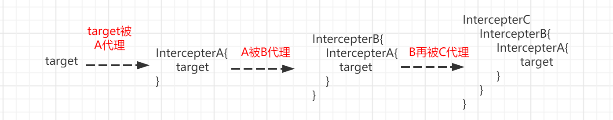

# plugins

## 1. Introduction

MyBatis 允许您在映射语句执行过程中对某一点进行拦截调用，这一功能在MyBatis中叫插件(plugins)。默认情况下，MyBatis允许使用插件来拦截的方法调用包括：

- 拦截执行器(`Executor`)的方法：*(update、query、flushStatements、commit、rollback、getTransaction、close、isClosed)*。
- 拦截参数处理器(`ParameterHandler`)的方法：*(getParameterObject、setParameters)*。
- 拦截结果处理器(`ResultSetHandler`)的方法：*(handleResultSets、handleCursorResultSets、handleOutputParameters)*。
- 拦截Sql语法构建处理器(`StatementHandler`)的方法：*(prepare、parameterize、batch、update、query、queryCursor)*。

这些类中方法的细节可以查看每个方法的签名，或者直接查看 MyBatis 发行包中的源代码。 如果你想做的不仅仅是监控方法的调用，那么你最好相当了解要重写的方法的行为。 因为在试图修改或重写已有方法的行为时，很可能会破坏 MyBatis 的核心模块。 这些都是更底层的类和方法，所以使用插件的时候要特别当心。

## 2. Specification

:white_check_mark: 使用 plugins 请先阅读(特别是项目集成了 PageHelper)：[QueryInterceptor规范](https://pagehelper.github.io/docs/interceptor/)

:white_check_mark: 动态代理模式的典型应用！

## 3. What can it do

1. 读写分离(读取访问 slave，写入访问 master)。

2. 分库分表(垂直、水平分库分表)。

3. 加密解密。

4. 通用设置，如分页(PageHelper)、SQL执行信息统计(如统计慢)。

## 4. Using Plugin

在MyBatis中使用插件非常简单，仅需如下三步：

1. 实现 *Interceptor*接口。
2. 指定想要拦截的方法签名。
3. 向 MyBatis 注册插件。

```java
//2. 指定想要拦截的方法签名
@Intercepts({
        @Signature(
                type = Executor.class,
                method = "query",
                args = {MappedStatement.class, Object.class, RowBounds.class, ResultHandler.class}
        )
})
//1. 实现 Interceptor 接口
public class SimplePlugin implements Interceptor {
    
  public Object intercept(Invocation invocation) throws Throwable {
      //do sth brfore returning the result
      //...
     Object result = invocation.proceed();
      //do sth after returning the result
      //...
      return result;
  }
    
  public Object plugin(Object target) {
    return Plugin.wrap(target, this);
  }
    
  public void setProperties(Properties properties) {
  }
    
}


```

```xml
<!-- 3. 向 MyBatis 注册插件(mybatis-config.xml) -->
<plugins>
    <plugin interceptor="org.format.mybatis.cache.interceptor.ExamplePlugin"></plugin>
</plugins>
```

## 5. Detailed Explanation

### 5.1. Intercepter Interface

*org.apache.ibatis.plugin.Interceptor* 接口源码如下：

```java
public interface Interceptor {
    
  Object intercept(Invocation invocation) throws Throwable;
    
  default Object plugin(Object target) {
    return Plugin.wrap(target, this);
  }
    
  default void setProperties(Properties properties) {
  }
    
}
```

**setProperties**

该方法用来传递插件的参数，可通过参数改变插件的行为。通常参数值是在配置插件时传递，如在`mybatis-config.xml`配置。

```xml
<!-- mybatis-config.xml -->
<plugins>
  <plugin interceptor="org.mybatis.example.ExamplePlugin">
    <property name="prop1" value="value1"/>
    <property name="prop2" value="value2"/>
  </plugin>
</plugins>
```

配置后的参数在拦截器初始化时会通过setProperties传递给拦截器，在拦截器中可以通过properties取得配置参数。

**plugin**

该方法用于创建被拦截接口的代理对象。该方法的参数target就是拦截器要拦截的对象，该方法会在创建被拦截接口的实现类时被调用，该方法的实现很简单，只需要调用Mybatis提供的Plugin类的静态方法wrap就可以通过Java动态**代理**拦截目标对象，默认已实现：

```java
@Override
public Object plugin(Object target) {
    //该方法就是JDK动态代理生成代理对象
    return Plugin.wrap(target, this);
}
```

**intercept**

该方法是Mybatis运行时要执行的拦截方法，该方法的参数`invocation`可以得到很多有用的信息。

```java
@Override
public Object intercept(Invocation invocation) throws Throwable {
    Method method = invocation.getMethod();
    Object target = invocation.getTarget();
    Object[] args = invocation.getArgs();
    Object result = invocation.proceed();
}
```

- invocation.getMethod()：获取当前被拦截的方法。
- invocation.getTarget()：获取当前被拦截的对象。
- invocation.getArgs()：获取被拦截方法的参数。
- invocation.proceed()：执行下个拦截器的 intercept 方法(如果存在的话)，否则调用被拦截对象的真正方法。

当配置多个拦截器时，Mybatis会遍历所有的拦截器，按顺序调用拦截器的`plugin`方法(创建代理对象)，**被拦截的对象就会被层层代理。** 在执行拦截对象的方法时，会一层层地调用拦截器，拦截器通过`invocation.proceed()`调用下一层方法，直到真正的方法被执行。最后方法执行的结果会从最里层开始向外一层层返回。

所以如果存在按顺序配置的A、B、C三个签名相同的拦截器，Mybatis会按照`C->B->A->target.proceed()->A->B->C`的顺序执行。如果A、B、C签名不同，就会按照Mybatis拦截对象的逻辑执行。

创建代理对象过程(目标对象被拦截器层层代理过程)：



经过层层代理，最终创建的(最外层)代理对象是最后一个拦截器生成的代理，因此在执行时，自然是从最外层代理对象开始逐层往内执行，即 C->B->A->target.proceed()，当执行target.proceed()调用目标方法并拿到返回结果时，自然也是原路返回 target.proceed()->A->B->C！

### 5.2. Method Signature

实现拦截器接口之后，需使用`@Intercepts`配置拦截器要拦截的接口方法。该注解的属性是一个`@Signature`数组，用于指定要拦截的方法签名，而数组意味着可以同时拦截多个。	

```java
@Documented
@Retention(RetentionPolicy.RUNTIME)
@Target(ElementType.TYPE)
public @interface Intercepts {
  /**
   * Returns method signatures to intercept.
   * @return method signatures
   */
  Signature[] value();
}
```

**@Signature**

`@Signature`用于指定要拦截的方法签名，该注解包含以下三个属性：

- type：设置拦截的接口，可选值是下述的**四个接口.**
- method：设置拦截接口的方法名，可选值是四个接口中对应的方法名称，需要和接口匹配.
- args：设置拦截接口方法的参数类型，通过方法名称和参数类型可确定唯一方法.

```java
@Documented
@Retention(RetentionPolicy.RUNTIME)
@Target({})
public @interface Signature {
  /**
   * Returns the java type.
   * @return the java type
   */
  Class<?> type();

  /**
   * Returns the method name.
   * @return the method name
   */
  String method();

  /**
   * Returns java types for method argument.
   * @return java types for method argument
   */
  Class<?>[] args();
}
```

#### 5.2.1. Executor

通过拦截 `Executor` 可以实现对执行器的处理过程进行拦截，`Executor` 允许插件拦截的方法：*(update, query, flushStatements, commit, rollback, getTransaction, close, isClosed)*。

- *<E> List<E> query(MappedStatement ms, Object parameter, RowBounds rowBounds, ResultHandler resultHandler) throws SQLException;*

  该方法会在SELECT查询方法执行时被调用。通过这个接口参数可以获得很多有用的信息，因此这是最常被拦截的一个方法。(需要注意的是，接口中还有一个6个参数的同名方法，但由于Mybatis设计原因，这个参数多的接口不能被拦截)。方法对应签名如下：

  ```java
  @Signature(
      type = Executor.class,
      method = "query",
      args = {MappedStatement.class, Object.class, RowBounds.class, ResultHandler.class}
  )
  ```

#### 5.2.2. ParameterHandler

通过拦截`ParameterHandler`可以实现对参数处理过程进行拦截，`ParameterHandler`允许拦截的方法：*(getParameterObject、setParameters)*。

- *Object getParameterObject();*

  该方法只在执行存储过程处理出参(OUT)的时候被调用。方法签名如下：

  ```java
  @Signature(
      type = ParameterHandler.class,
      method = "getParameterObject",
      args = {}
  )
  ```

- *void setParameters(PreparedStatement ps) throws SQLException;*

  该方法在设置SQL参数时被调用。方法对应签名如下：

  ```java
  @Signature(
      type = ParameterHandler.class,
      method = "setParameters",
      args = {PreparedStatement.class}
  )
  ```

#### 5.2.3. ResultSetHandler

通过拦截`ResultSetHandler`可以实现对结果集处理过程进行拦截。`ResultSetHandler`允许拦截的方法：(handleResultSets、handleCursorResultSets、handleOutputParameters)。

- *<E> List<E> handleResultSets(Statement stmt) throws SQLException;*

  该方法会在除存储过程及返回值类型为 Cursor<T> 以外的查询方法中被调用。方法签名如下：

  ```java
  @Signature(
      type = ResultSetHandler.class,
      method = "handleResultSets",
      args = {Statement.class}
  )
  ```

- *<E> Cursor<E> handleCursorResultSets(Statement stmt) throws SQLException;*

  该方法只会在返回值类型为 Cursor<T> 的查询方法中被调用。方法签名如下：

  ```java
  @Signature(
      type = ResultSetHandler.class,
      method = "handleCursorResultSets",
      args = {Statement.class}
  )
  ```

- *void handleOutputParameters(CallableStatement cs) throws SQLException;*

  该方法只在使用存储过程处理出参(OUT)时被调用。方法签名如下：

  ```java
  @Signature(
      type = ResultSetHandler.class,
      method = "handleOutputParameters",
      args = {Statement.class}
  )
  ```

`ResultSetHandler` 接口的 `handleResultSets` 方法对于拦截处理 MyBatis 的查询结果非常有用，并且由于这个方法被调用的位置在处理二级缓存之前，因此通过这种方式处理的结果还可以被执行二级缓存！

#### 5.2.4. StatementHandler

通过拦截 `StatementHandler` 可以实现对Sql语法构建过程进行拦截。`StatementHandler` 允许拦截的方法：*(prepare、parameterize、batch、update、query、queryCursor)*。

- *Statement prepare(Connection connection, Integer transactionTimeout) throws SQLException;*

  该方法会在数据库执行前被调用，优先于当前接口的其他方法执行。方法签名如下：

  ```java
  @Signature(
      type = Statement.class,
      method = "prepare",
      args = {Connection.class, Integer.class}
  )
  ```

- *void parameterize(Statement statement) throws SQLException;*

  该方法在 prepare 方法之后执行，用于处理参数信息。方法签名如下：

  ```java
  @Signature(
      type = Statement.class,
      method = "parameterize",
      args = {Statement.class}
  )
  ```

- *void batch(Statement statement) throws SQLException;*

  当配置 `defaultExecutorType="BATCH"` 时，执行数据库操作才会调用该方法。方法签名如下：

  ```java
  @Signature(
      type = Statement.class,
      method = "batch",
      args = {Statement.class}
  )
  ```

- *int update(Statement statement) throws SQLException;*

  当执行 UPDATE 方法时调用。方法签名如下：

  ```java
  @Signature(
      type = Statement.class,
      method = "update",
      args = {Statement.class}
  )
  ```

- *<E> List<E> query(Statement statement, ResultHandler resultHandler) throws SQLException;*

  当执行 SELECT 方法时调用。方法签名如下：

  ```java
  @Signature(
      type = Statement.class,
      method = "update",
      args = {Statement.class, ResultHandler.class}
  )
  ```

-  *<E> Cursor<E> queryCursor(Statement statement) throws SQLException;*

  该方法只会在返回值类型为 Cursor<T> 的查询方法中被调用。方法签名如下：

  ```java
  @Signature(
      type = Statement.class,
      method = "queryCursor",
      args = {Statement.class}
  )
  ```

### 5.3. Register Plugin

#### 5.3.1. Using XML

向 MyBtais 注册插件的一种方式是使用`<plugins></plugins>`在 *mybatis-config.xml*中进行注册，如下所示：

```xml
<configuration>
    <!-- ... other configuration -->
	<plugins>
    	<plugin interceptor="IntercepterA"></plugin>
        <plugin interceptor="IntercepterB"></plugin>
        <plugin interceptor="IntercepterC"></plugin>
	</plugins>
    <!-- ... other configuration -->
</configuration>
```

#### 5.3.2. Without XML

如果您使用的是Java构建配置文件而不是XML，则可以通过如下方式注册插件：

```java
Configuration configuration = new Configuration();
//... other configuration
configuration.addInterceptor(IntercepterA);
configuration.addInterceptor(IntercepterB);
configuration.addInterceptor(IntercepterC);
return new SqlSessionFactoryBuilder().build(configuration);
```

## 6. F.Q.A.

[:white_check_mark: QueryInterceptor规范](https://pagehelper.github.io/docs/interceptor/)

1. 拦截器的配置和调用顺序？
2. 为什么6个参数 query 方法不能被拦截？如果想拦截应该怎么做？
3. PageHelper 导致自定义拦截器失效？
4. PageHelper 分页只对后一条SQL有效的原因？

## 7. Example

### 7.1. Sharing Table

#### 7.1.1. Concept

### 7.2. 读写分离

### 7.3. 通用分页