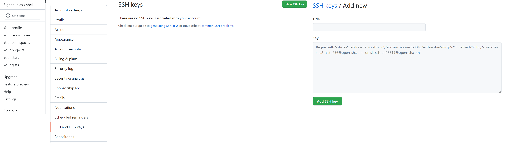

# F.Q.A

## F.Q List

- [Token authentication requirements for Git operations.](#1.Token authentication requirements for Git operations)


## Q.A List

### 1.Token authentication requirements for Git operations

[git authentication doc](https://docs.github.com/en/authentication)

#### Background

- [git blog: token-authentication-requirements-for-git-operations](https://github.blog/2020-12-15-token-authentication-requirements-for-git-operations/)

从 2021-08-13 开始，Github 要求所有需要认证的 Git 操作都要求使用基于令牌(token)的认证，不再支持账号/密码认证。受影响的方面：

- Git 命令行访问(如 git bash)。
- Git 桌面端应用(如 git gui)；GitHub 桌面端不受影响。
- 所有使用密码直接访问 GitHub.com 上的 Git 存储库的任何应用程序/服务。

#### Connect-With-SSH

使用 SSH 协议，你能够连接并验证远程服务器和服务，使用 SSH 密钥，您可以连接到 GitHub，而无需在每次访问时提供您的用户名和个人访问令牌。

当设置 SSH 验证时，首先需要产生一个 SSH 密钥(如果没有的话)并增加到 ssh-agent，然后把 SSH 密钥添加到您的 GitHub 账户。如下操作使用 git bash 进行：

- 查看已存在的 SSH 密钥：

  ```bash
  $ ls -al ~/.ssh
  # Lists the files in your .ssh directory, if they exist
  
  # 查看已存在公钥的指纹
  $ ssh-keygen -lf ~/.ssh/id_ed25519.pub
  ```

- 如果已经存在 SSH 密钥，您可以使用它，否则必须产生一个新的：

  ```bash
  # 使用 ed25519 创建 SSH 密钥，替换邮箱地址为您自己的邮箱
  $ ssh-keygen -t ed25519 -C "xbhel@outlook.com"
  # OR
  # 如果您的机器不支持 ed25519 算法，您可以使用 rsa
  $ ssh-keygen -t rsa -b 4096 -C "your_email@example.com"
  
  # 回车您将看到一下输出，并且接下来是一个交互窗口
  > Generating public/private ed25519 key pair.
  
  # 设置您保存密钥的文件并回车，默认是 (/c/Users/you/.ssh/id_algorithm)
  > Enter file in which to save the key(/c/Users/you/.ssh/id_algorithm):[Press enter]
  
  # 设置您的密码并回车
  > Enter passphrase (empty for no passphrase): [Type a passphrase]
  > Enter same passphrase again: [Type passphrase again]
  
  # 此时你可以再次查看密钥，其中 id_ed25519 表示私钥，id_ed25519.pub 公钥
  $ ls -al ~/.ssh
  > id_ed25519  id_ed25519.pub
  ```

- 添加您的 SSH 密钥到 ssh-agent。确认 ssh-agent 在运行，您可以配置[自动启动 ssh-agent](https://docs.github.com/en/authentication/connecting-to-github-with-ssh/working-with-ssh-key-passphrases) 或以如下方式手动启动它：

  ```bash
  # 以后台方式启动 ssh-agent
  $ eval "$(ssh-agent -s)"
  > Agent pid 59566
  ```

- 添加 SSH 私钥到 ssh-agent：

  ```bash
  $ ssh-add ~/.ssh/id_ed25519
  ```

- 添加 SSH 密钥到您的 GItHub 账户，在您的 GitHun 账户中添加 SSH 密钥后，您可以重新配置任意的本地仓库使用 SSH 方式连接。

  - 复制私钥对应的公钥:

    ```bash
    # 使用如下命令复制 id_ed25519.pub 的内容或者直接打开 id_ed25519.pub 复制
    $ clip < ~/.ssh/id_ed25519.pub
    ```

  - 登录 [GitHub](https://github.com/)，依次点击 [右上角头像 -> Settings -> SSH and GPG keys -> New SSH key ](https://github.com/settings/keys):

    

  - Title 字段为您的描述性标签，可为任意字符串。Key 字段请粘贴您刚刚复制的公钥。完成后点击 [Add SSH key]()。如果出现密码弹框，请输入您的 GitHub 账号密码。

- 测试使用 SSH 连接 GitHub。打开您的 git bash:

  ```bash
  $ ssh -T git@github.com
  # 您可能会看到如下警告
  > The authenticity of host 'github.com (IP ADDRESS)' can't be established.
  > RSA key fingerprint is SHA256:nThbg6kXUpJWGl7E1IGOCspRomTxdCARLviKw6E5SY8.
  > Are you sure you want to continue connecting (yes/no)? [yes]
  
  # 验证您看到的消息中的指纹是否与 GitHub 的 RSA 公钥指纹匹配 (见下链接)。如果是，则输入 yes。然后您将得到如下输出：
  > Hi {your name}! You've successfully authenticated, but GitHub does not provide shell access.
  
  # 如果您得到的输出是，则尝试重新运行 ssh -T git@github.com
  > Warning: Permanently added 'github.com,52.74.223.119' (RSA) to the list of known hosts.
  > Connection reset by 52.74.223.119 port 22
  
  # 如果您得到是 "Permission denied'，请查看 "Error: Permission denied (publickey)".（见下链接）
  ```

  - [GitHub's RSA public key fingerprint](https://docs.github.com/en/github/authenticating-to-github/githubs-ssh-key-fingerprints)

  - [Error: Permission denied (publickey)](https://docs.github.com/en/articles/error-permission-denied-publickey)

- 使用 SSH 连接您的仓库，此后您可以正常操作仓库。

  ```bash
  $ git remote add origin git@github.com:xbhel/notes.git
  ```

  